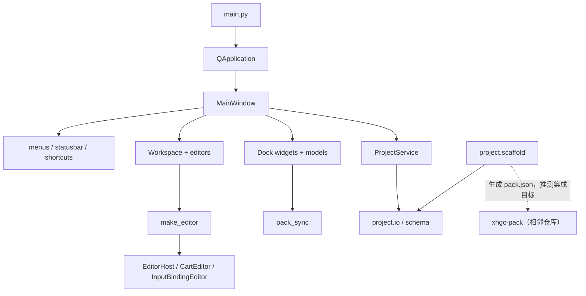
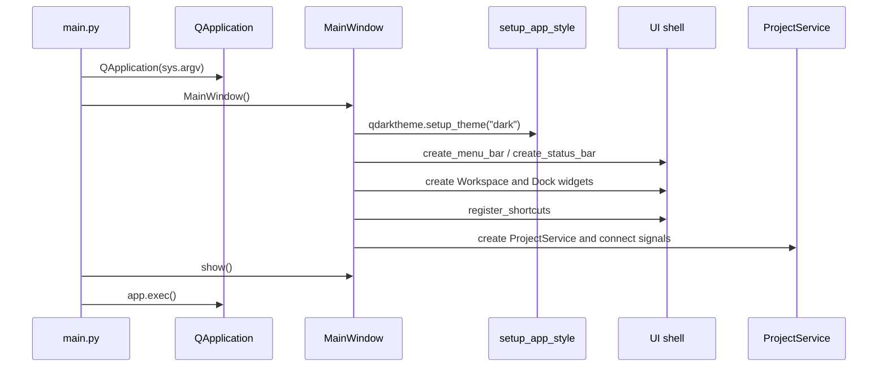
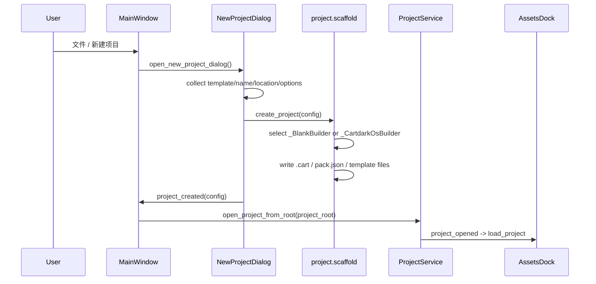
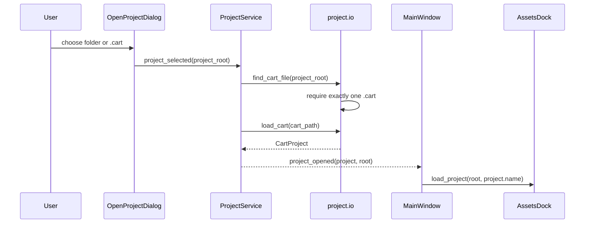
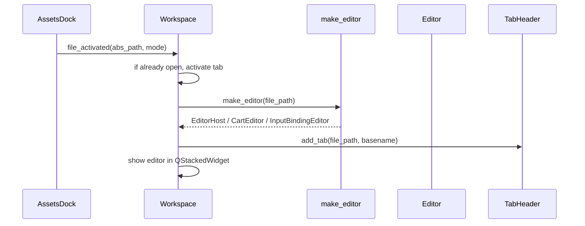
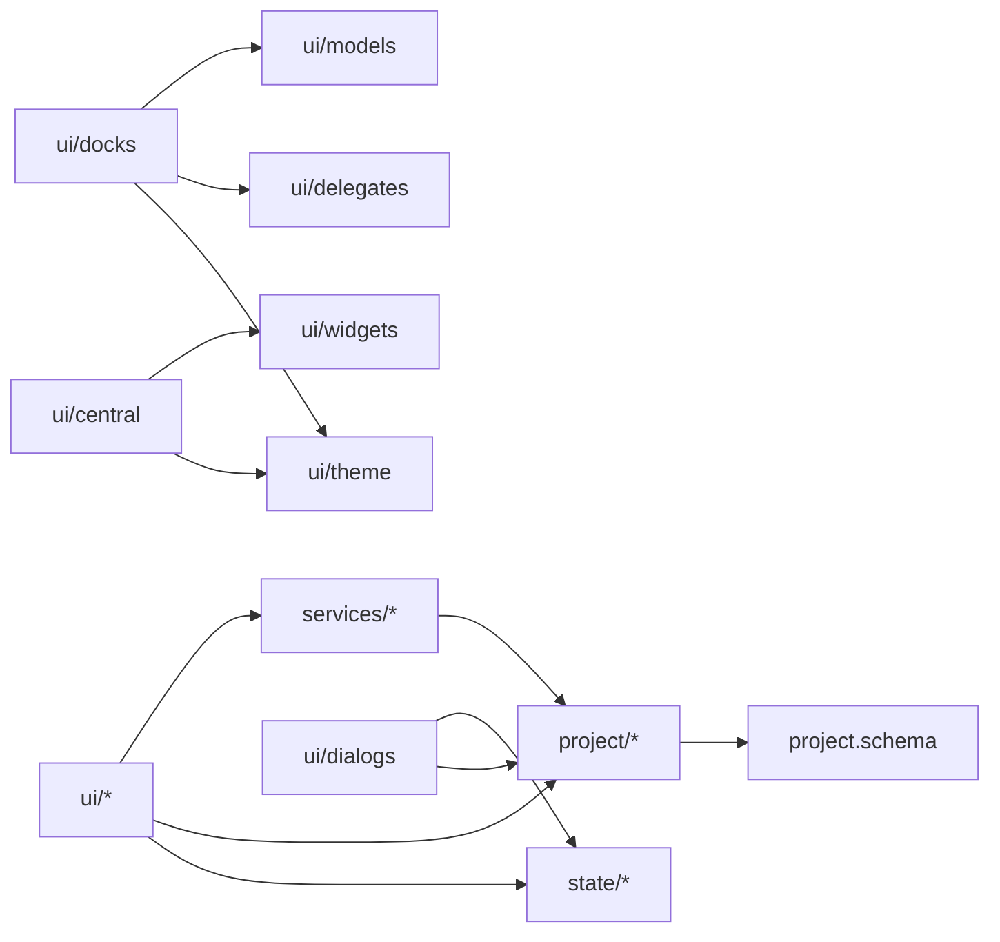

# CartDark IDE 架构说明

> 检查日期：2026-06-09  
> 范围：当前 `cartdark-IDE` 仓库源码与仓库内文档。相邻 `xhgc-pack` 打包器和 STM32 固件只作为生态背景提及；本文件不把相邻仓库能力写成本仓库已实现能力。

## 系统总览

CartDark IDE 是一个基于 PySide6/Qt6 的桌面 IDE。当前源码确认的核心能力包括：

- 启动 Qt 应用并创建主窗口。
- 创建菜单栏、状态栏、中央工作区、资源/修改文件/大纲/属性/底部 Dock。
- 通过新建项目对话框生成 `blank` 或 `cartdark_os` 项目模板。
- 通过打开项目对话框选择项目目录或 `.cart` 文件，并加载项目根目录。
- 在资源树中扫描项目文件，打开文件到中央多标签工作区。
- 以纯文本方式编辑普通文件和 `.lua` 文件，Lua 有简易语法高亮、本地代码补全、常用语法片段、基础编辑辅助和已知 API hover tooltip，并按文本模式为 `.cart`、`.input_binding`、`.json`、`.layer` 提供 JSON 高亮与 key 补全。
- 以可视化编辑器编辑 `.cart` 与 `.input_binding` 文件。
- 维护部分 `pack.json` 规则，例如校验、格式化、重建 `res/**/*` chunk，以及在资源重命名/删除时同步部分路径。
- 切换暗色/亮色主题，并向部分自定义 UI 组件广播主题变化。

未确认或未实现的能力：

- 构建运行：菜单和快捷键存在入口，但 `MainWindow.build_and_run()` 未在源码中定义。
- 调试器：快捷键 `F5` 绑定了 `MainWindow.start_debugger()`，但该方法未在源码中定义。
- 全局文件搜索：快捷键 `Ctrl+Shift+F` 绑定了 `MainWindow.open_search_in_files()`，但该方法未在源码中定义。
- 插件机制：未找到插件注册、加载、发现或扩展点源码。
- 语言服务/LSP：未找到语言服务器、诊断或索引实现；当前补全和 hover 是编辑器内的静态 `QCompleter` / `QToolTip`，不是 LSP。
- CI、lint、test 配置：未在仓库根目录或常见配置路径中找到。

## 高层架构图

实线表示源码确认的调用或组合关系。虚线表示从文档或生态命名推测的外部关系。

## 启动流程

源码确认流程：

对应文件：

- `main.py`
- `src/cartdark_ide/app/main_window.py`
- `src/cartdark_ide/app/app_style.py`
- `src/cartdark_ide/app/menus.py`
- `src/cartdark_ide/app/shortcuts.py`
- `src/cartdark_ide/services/project_service.py`

## 核心模块说明

| 模块 | 主要文件 | 当前已确认职责 | 状态 |
|---|---|---|---|
| 应用入口 | `main.py` | 创建 `QApplication`、创建并显示 `MainWindow`、进入 Qt 事件循环 | 已实现 |
| 主窗口 / UI shell | `src/cartdark_ide/app/main_window.py` | 组合菜单栏、状态栏、中央工作区、Dock 面板和 `ProjectService` | 已实现 |
| 菜单与动作 | `src/cartdark_ide/app/menus.py`, `src/cartdark_ide/app/actions.py` | 创建菜单和 QAction；新建/打开项目、主题切换、面板显示切换有绑定 | 部分实现 |
| 快捷键 | `src/cartdark_ide/app/shortcuts.py` | 注册全局快捷键，部分调用编辑器操作和面板显示切换 | 部分实现，存在未定义目标方法 |
| 中央工作区 | `src/cartdark_ide/workspace/workspace.py` | 管理欢迎页、标签栏、编辑器页，支持打开/保存/关闭文件 | 部分实现 |
| 文本编辑器 | `src/cartdark_ide/editors/editor_host.py`, `src/cartdark_ide/editors/completion.py`, `src/cartdark_ide/ui/central/api_catalog.py` | `QPlainTextEdit`、行号、Lua / JSON 高亮、本地代码补全、Lua 自动缩进/Tab/成对括号/括号匹配、API hover、查找栏、保存、撤销/重做 | 已实现 |
| `.cart` 可视化编辑器 | `src/cartdark_ide/editors/cart_editor.py` | 编辑 Project / Display / Bootstrap 页面并保存 JSON | 已实现 |
| `.input_binding` 可视化编辑器 | `src/cartdark_ide/editors/input_binding_editor.py` | 编辑 pin/touch/gamepad triggers，读取 `board/pins.json` 作为 pin 下拉来源 | 已实现 |
| 项目服务 | `src/cartdark_ide/services/project_service.py` | 打开/关闭项目，发出 `project_opened`、`project_closed`、`error_occurred` 信号 | 已实现 |
| 项目 IO | `src/cartdark_ide/project/io.py` | 查找项目根目录中的 `.cart`，读取 `.cart` 到 dataclass 模型 | 已实现 |
| 项目 schema | `src/cartdark_ide/project/schema.py` | 定义 `.cart` 和 `pack.json` v1.1 相关 dataclass 与 `to_dict()` | 已实现 |
| 项目脚手架 | `src/cartdark_ide/project/scaffold.py` | 生成 `blank` / `cartdark_os` 项目目录、`.cart`、`pack.json`、模板文件 | 已实现 |
| 打包清单同步 | `src/cartdark_ide/project/pack_sync.py` | 校验/格式化 `pack.json`，同步部分 `res/` 路径，重建 `res/**/*` RES chunk | 部分实现 |
| 资源面板 | `src/cartdark_ide/assets/assets_dock.py`, `src/cartdark_ide/assets/assets_fs_model.py` | 扫描项目目录、显示资源树、右键菜单、文件增删改导入、打开文件 | 已实现 |
| 底部面板 | `src/cartdark_ide/panels/bottom_dock.py` | 创建控制台/构建错误/搜索结果/断点标签 | 部分实现；只有控制台页有实际 widget，其他为占位 QWidget |
| 设置持久化 | `src/cartdark_ide/core/settings_store.py`, `src/cartdark_ide/panels/bottom_dock.py` | 使用 QSettings 保存上次项目位置和底部面板主题标志 | 部分实现 |
| 主题系统 | `src/cartdark_ide/ui/theme.py`, `src/cartdark_ide/app/app_style.py` | qdarktheme 默认暗色；自定义 theme token 通过 Signal 通知组件 | 已实现 |
| 空文件/占位模块 | `recent_service.py`, `workspace_service.py`, `project/model.py`, `project/layout.py`, `project/constants.py`, `project/migrate.py` | 文件存在但内容为空 | 未确认 |

迁移说明：`src/cartdark_ide/ui/*` 与 `src/cartdark_ide/state/*` 中的旧路径模块当前保留为兼容 wrapper，真实实现已移动到 `app/`、`workspace/`、`editors/`、`assets/`、`panels/`、`dialogs/`、`widgets/` 和 `core/`。

## 主要数据流

### 新建项目

源码确认流程：

已确认：

- `NewProjectDialog` 支持 `blank` 和 `cartdark_os` 两个模板。
- 项目名称只允许 `A-Z`、`a-z`、数字、下划线、短横线，且不能以 `.` 开头。
- 上次项目位置通过 `SettingsStore.last_project_location` 保存。
- `cartdark_os` 模板会生成 `board/`、`input/`、`main/`、`res/`、`script/` 目录，并写入 `main.lua`、`input/game.input_binding`、`board/pins.json`、`main/Layer0.collection`、`main/Layer1.collection`。
- `NewProjectDialog.update_project_tree()` 预览显示的清单文件名与脚手架一致，均为 `pack.json`。

### 打开项目

源码确认流程：

已确认：

- 项目根目录必须存在且包含一个 `.cart` 文件。
- 如果 `.cart` 文件不存在或超过一个，`find_cart_file()` 抛出 `ProjectLoadError`。
- `load_cart()` 支持读取 `bootstrap.layers`，也支持旧式 `bootstrap.main_collection` 回退。

### 打开文件

源码确认流程：

编辑器选择规则：

- `mode == "text"`：强制使用 `EditorHost`。
- `.input_binding` 且 `mode == "editor"`：使用 `InputBindingEditor`。
- `.cart` 且 `mode == "editor"`：使用 `CartEditor`。
- 其他文件：使用 `EditorHost`。

### 保存文件

源码确认：

- `Workspace.save_current()` 通过当前 tab id 找到编辑器，并调用编辑器 `save()`。
- `Workspace.save_all()` 遍历所有已打开编辑器，对 `modified == True` 的编辑器调用 `save()`。
- `EditorHost.save()` 将 `QPlainTextEdit` 全文写回原文件。
- `CartEditor.save()` 读取现有 JSON（失败则用空对象），写入 `format`、`version`，再由页面写入 `project`、`display`、`bootstrap`。
- `InputBindingEditor.save()` 构建标准 `CART_INPUT_BINDING` JSON 并写回文件。

未确认：

- README 中列出的 `Ctrl+W` 关闭当前标签、`Ctrl+Shift+T` 重开关闭标签，对应方法 `Workspace.close_current_tab()` 和 `Workspace.reopen_last_closed()` 未在当前源码中定义。
- `Workspace._close_tab()` 删除最后一个标签后回到欢迎页的逻辑位于 `return` 之后，不会执行。该行为应视为实现缺陷，而不是架构设计。

### 资源与文件系统

源码确认：

- `AssetsFsModel.load_from_root()` 递归扫描项目目录并构建 `QStandardItemModel`。
- 扫描会跳过 `.venv`、`.git`、`.idea`、`__pycache__`、`.DS_Store`、`Thumbs.db`，也跳过除 `.gitignore` 外的隐藏文件。
- 目录排在文件前，同类按名称排序。
- `AssetsDock` 右键菜单支持新建文件、Lua 脚本、文件夹、导入、重命名、删除、复制、刷新、复制路径、在系统文件管理器中显示。
- 删除文件后发出 `file_deleted(abs_path)`，`MainWindow` 将其连接到 `Workspace.close_file()`。

### `pack.json` 维护

源码确认：

- `schema.py` 定义 `PackJson`、`PackMeta`、`PackIcon`、`PackHash`、`PackBuild`、`PackChunk`。
- `scaffold.py` 为新项目写入 `pack.json`。
- `pack_sync.validate()` 检查 `pack.json` 是否存在、JSON 是否可读、`icon.path` 和 `meta.entry` 指向文件是否存在、每个 chunk 的 glob 是否匹配到文件。
- `pack_sync.format_json()` 重新格式化 `pack.json`。
- `pack_sync.regenerate_from_res()` 只替换 `type == "RES"` 且 glob 以 `res/` 开头的 chunk 为 `res/**/*`。
- `on_file_renamed()` 和 `on_file_deleted()` 只在部分情况下同步 `icon.path`、`meta.entry` 和旧式 `type == "script"` chunk。

文档与实现差异 / 待确认：

- `schema.PackChunk` 注释和 `pack.json` v1.1 语义使用 `MANF` / `LUA` / `RES`，但 `pack_sync.add_script_to_pack()` 和 `remove_script_from_pack()` 仍使用旧式 `type == "script"` 与 `res` 列表。该结构是否仍被打包器接受，当前仓库无法确认。
- `cartdark_os` 模板生成的 `pack.json` 包含根目录 `main.lua` 的 `LUA` chunk，`meta.entry` 为 `main.lua`。是否可被当前相邻 `xhgc-pack` 完整构建，当前仓库无法确认。
- `PackIcon.path` 默认是 `res/icon.png`，但当前脚手架没有生成该文件。新项目立即通过 `pack_sync.validate()` 时可能报告 `icon.path 文件不存在`。

### 构建运行

源码确认：

- 菜单中创建了“构建”和“运行” QAction。
- 快捷键中将 `Ctrl+B` 绑定到 `window.build_and_run()`。

未确认：

- 当前源码未定义 `MainWindow.build_and_run()`。
- 当前源码未找到调用 `xhgc-pack`、生成 `cart.bin`、解析打包器 JSON 输出、启动模拟器或下载到 STM32 的实现。
- 当前源码未找到构建错误模型和底部“构建错误”页之间的数据连接。

因此，本仓库当前不能被文档描述为已经实现“构建并运行”闭环。

### 调试

源码确认：

- 快捷键中将 `F5` 绑定到 `window.start_debugger()`。
- 底部面板中创建了“断点”标签名称。

未确认：

- 当前源码未定义 `MainWindow.start_debugger()`。
- 当前源码未找到断点模型、调试协议、调试会话或 STM32 调试集成。
- 底部“断点”页当前是占位 `QWidget()`。

### 搜索

源码确认：

- `EditorHost` 具有当前文件内查找栏，支持文本变化时查找、高亮匹配、上一个/下一个、大小写匹配。
- 快捷键中将 `Ctrl+Shift+F` 绑定到 `window.open_search_in_files()`。
- 底部面板中创建了“搜索结果”标签名称。

未确认：

- 当前源码未定义 `MainWindow.open_search_in_files()`。
- 当前源码未找到项目级文件搜索实现。
- 底部“搜索结果”页当前是占位 `QWidget()`。

## 生命周期

### 应用生命周期

已确认：

1. `main.py` 创建 Qt 应用。
2. `MainWindow.__init__()` 设置样式、菜单、状态栏、中央工作区、Dock、快捷键和项目服务。
3. `window.show()` 显示主窗口。
4. `app.exec()` 进入 Qt 事件循环。

未确认：

- 未找到应用退出时保存窗口布局、打开文件列表或项目状态的逻辑。

### 项目生命周期

已确认：

1. `ProjectService.open_project_from_root()` 查找并读取 `.cart`。
2. 成功后更新 `_current_project` 和 `_current_root`。
3. 发出 `project_opened(project, root)`。
4. `MainWindow._on_project_opened()` 更新窗口标题并加载资源树。
5. `ProjectService.close_project()` 清空当前项目状态并发出 `project_closed()`。
6. `MainWindow._on_project_closed()` 重置窗口标题并关闭资源树项目。

未确认：

- 关闭项目时未在 `MainWindow._on_project_closed()` 中看到 `Workspace.close_all()` 调用。当前源码无法确认关闭项目会关闭已打开标签。
- README 提到“自动恢复上次打开路径”，源码确认的是新建/打开项目对话框使用 `last_project_location`，未确认自动恢复上次已打开项目。

### 编辑器生命周期

已确认：

1. 文件从资源树激活后进入 `Workspace.open_file()`。
2. 已打开且 mode 相同则切换标签。
3. 已打开但 mode 不同则尝试关闭原标签，并在未取消时重新创建编辑器。
4. 编辑器 `modified_changed(bool)` 连接到标签栏修改标记。
5. 关闭修改过的标签时弹出保存/不保存/取消确认。

未确认：

- `CartEditor` 和 `InputBindingEditor` 没有实现 `undo()`、`redo()`、`show_find()`，因此通用编辑快捷键只对具备这些方法的编辑器生效。

### 主题生命周期

已确认：

- 启动时 `setup_app_style()` 调用 `qdarktheme.setup_theme("dark")`。
- `theme` 是全局 `_Theme` 单例，可发出 `changed("dark" | "light")`。
- 菜单中“黑色/白色”主题动作调用 `qdarktheme.setup_theme()` 并调用 `theme.set()`。
- `Workspace`、`EditorHost`、`CartEditor`、`InputBindingEditor`、`TabHeader` 等组件监听或应用 theme token。
- `BottomDock` 单独通过 `QSettings("cartdark", "IDE").value("theme_dark")` 读取主题标志。

未确认：

- 菜单主题切换代码没有调用 `BottomDock.save_theme()`，因此底部面板主题持久化是否生效未确认。
- `SettingsStore` 使用 `QSettings("CartDark", "CartDark IDE")`，`BottomDock` 使用 `QSettings("cartdark", "IDE")`，两套 key 空间是否有意区分未确认。

## 配置与持久化

| 配置 | 存储 | 写入位置 | 读取位置 | 状态 |
|---|---|---|---|---|
| 上次项目位置 | `QSettings("CartDark", "CartDark IDE")`, key `project/last_location` | `NewProjectDialog.on_create()`、`OpenProjectDialog._on_open()` | `NewProjectDialog.__init__()`、`OpenProjectDialog._on_browse()` | 已实现 |
| 底部面板主题标志 | `QSettings("cartdark", "IDE")`, key `theme_dark` | `BottomDock.save_theme()` 函数存在 | `BottomDock._load_dark()` | 部分实现，调用链未确认 |
| 全局主题名 | 进程内 `_Theme._name` | `theme.set()` | 组件直接读取 `theme` token | 已实现，未确认持久化 |
| 最近项目列表 | 未找到实现 | 未确认 | 未确认 | 未确认 |
| 窗口布局 | 未找到实现 | 未确认 | 未确认 | 未确认 |

## 插件 / 扩展机制

未确认。

检查范围内未找到以下内容：

- 插件目录或 manifest。
- 插件注册表。
- 动态加载器。
- 扩展点接口。
- 第三方命令/工具发现机制。

当前可以确认的扩展方式只有源码级扩展，例如在 `make_editor()` 增加新的文件类型编辑器，或在 `AssetsDock` 增加右键菜单命令。这是代码改动模式，不是运行时插件机制。

## 模块依赖关系

说明：

- `MainWindow` 是 UI 组合根。
- `ProjectService` 将 UI 与 `.cart` 读取逻辑隔开。
- `Workspace` 通过编辑器工厂选择具体编辑器。
- `AssetsDock` 同时依赖资源模型、文件系统操作和 `pack_sync`。
- `SettingsStore` 当前只提供少量设置持久化。

## 文档与实现差异

| 位置 | 文档描述 | 源码现状 |
|---|---|---|
| `README.md` 快捷键表 | `Ctrl+W` 关闭当前标签、`Ctrl+Shift+T` 重开最近关闭文件 | `Workspace.close_current_tab()`、`Workspace.reopen_last_closed()` 未定义 |
| `README.md` 快捷键表 | `Ctrl+B` 构建并运行、`F5` 启动调试器、`Ctrl+Shift+F` 文件中搜索 | `MainWindow.build_and_run()`、`start_debugger()`、`open_search_in_files()` 未定义 |
| `README.md` 项目管理 | 自动恢复上次打开路径 | 源码确认保存/读取上次项目位置；未确认自动恢复上次已打开项目 |
| `docs/CART_PROJECT v1.md` | `bootstrap.mode` 固定为 `"ltdc_2layer"` | `BootstrapConfig` 默认和脚手架当前写入 `"LTDC"` |
| `README.md` / 功能描述 | 构建错误、搜索结果、断点面板暗示功能 | `BottomDock` 为这些标签创建占位 `QWidget()`，未找到数据流 |

## 待确认点

- 是否要将 `.cart` 的 `bootstrap.mode` 统一为 `ltdc_2layer`，或更新文档接受 `LTDC`。
- `cartdark_os` 模板的 `pack.json` 已包含根目录 `main.lua` 的 `LUA` chunk；仍需确认当前相邻 `xhgc-pack` 对根目录 Lua entry 的实现支持。
- `pack_sync` 中旧式 `type == "script"` chunk 是否仍需保留，还是应迁移到 `LUA` chunk。
- 新建项目是否应生成 `res/icon.png`，以满足默认 `PackIcon.path`。
- 菜单 QAction 是否应补齐保存/退出/撤销/重做/构建/运行的连接。
- 是否需要实现 `Workspace.close_current_tab()` 和 `Workspace.reopen_last_closed()`。
- 是否需要在关闭项目时关闭中央工作区所有标签。
- 底部面板的构建错误、搜索结果、断点页是否要接入真实模型。
- 主题持久化是否统一到同一套 `QSettings` 命名空间。
- 是否计划引入插件机制。如果计划引入，需要另行设计 manifest、加载生命周期和安全边界。

## 参考文件

- `main.py`
- `README.md`
- `docs/CART_PROJECT v1.md`
- `docs/spec-input-binding-v1.md`
- `AGENTS.md`
- `src/cartdark_ide/app/main_window.py`
- `src/cartdark_ide/app/menus.py`
- `src/cartdark_ide/app/actions.py`
- `src/cartdark_ide/app/shortcuts.py`
- `src/cartdark_ide/app/statusbar.py`
- `src/cartdark_ide/app/app_style.py`
- `src/cartdark_ide/ui/theme.py`
- `src/cartdark_ide/workspace/workspace.py`
- `src/cartdark_ide/editors/editor_host.py`
- `src/cartdark_ide/editors/cart_editor.py`
- `src/cartdark_ide/editors/input_binding_editor.py`
- `src/cartdark_ide/dialogs/new_project_dialog.py`
- `src/cartdark_ide/dialogs/open_project_dialog.py`
- `src/cartdark_ide/assets/assets_dock.py`
- `src/cartdark_ide/panels/bottom_dock.py`
- `src/cartdark_ide/assets/assets_fs_model.py`
- `src/cartdark_ide/project/io.py`
- `src/cartdark_ide/project/schema.py`
- `src/cartdark_ide/project/scaffold.py`
- `src/cartdark_ide/project/pack_sync.py`
- `src/cartdark_ide/services/project_service.py`
- `src/cartdark_ide/core/settings_store.py`

## 检查记录

- 构建/依赖配置检查：未找到 `package.json`、`CMakeLists.txt`、`Cargo.toml`、`pyproject.toml`、`pnpm-lock.yaml`、`yarn.lock`、`requirements*.txt`。
- 文档检查命令：未找到仓库内配置。
- lint 命令：未找到仓库内配置，例如 `ruff.toml`、`.ruff.toml`、`.pre-commit-config.yaml`。
- test 命令：未找到仓库内配置，例如 `pytest.ini`、`tox.ini`，也未找到测试文件。
- 类型检查命令：未找到仓库内配置，例如 `mypy.ini`。
- Python 编译检查：`./.venv/bin/python -m compileall -q main.py src`，通过。
- Qt offscreen 主窗口烟测：`QT_QPA_PLATFORM=offscreen ./.venv/bin/python -c "from PySide6.QtWidgets import QApplication; from src.cartdark_ide.ui.main_window import MainWindow; app=QApplication([]); w=MainWindow(); print(w.windowTitle())"`，通过，输出 `CartDark - IDE`。Qt 同时输出字体别名性能提示：`Replace uses of missing font family "Sans Serif" with one that exists to avoid this cost.`。
